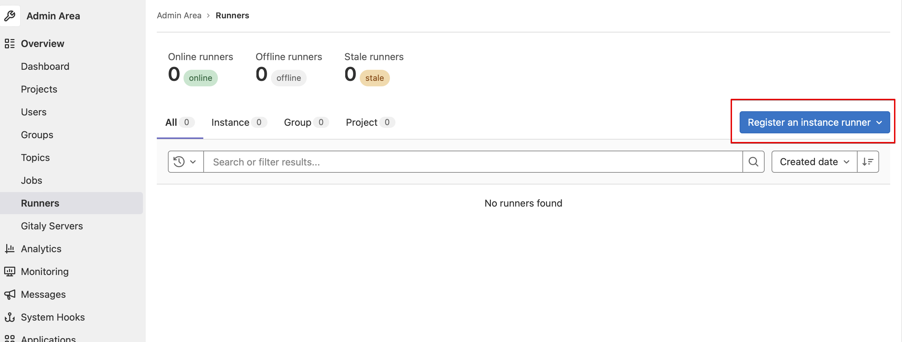

<目次>

- [概要](#概要)
- [前提条件](#前提条件)
  - [インターネット接続](#インターネット接続)
  - [手順の範囲](#手順の範囲)
  - [AWS、Gitlab環境](#awsgitlab環境)
  - [Hugoのテーマ](#hugoのテーマ)
  - [Gitlabにフォーカスした手順](#gitlabにフォーカスした手順)
- [構築環境](#構築環境)
  - [考え方](#考え方)
  - [EC2インスタンス](#ec2インスタンス)
- [手順](#手順)
  - [リポジトリのclone](#リポジトリのclone)
  - [EC2インスタンス構築](#ec2インスタンス構築)
  - [terraformで出力される情報をメモる](#terraformで出力される情報をメモる)
  - [Gitlabにログインする](#gitlabにログインする)
  - [Gitlab Runnerのtoken参照](#gitlab-runnerのtoken参照)
  - [ansibleによるミドルウエアインストール・設定](#ansibleによるミドルウエアインストール設定)
  - [IPアドレスとtokenの書き換え](#ipアドレスとtokenの書き換え)
  - [ansible playbookの起動](#ansible-playbookの起動)
  - [EC2インスタンスにログイン](#ec2インスタンスにログイン)
  - [gitlab.rbの編集](#gitlabrbの編集)
  - [編集の有効化](#編集の有効化)
  - [GitHubからリポジトリのインポート](#githubからリポジトリのインポート)
  - [config.tomlの編集](#configtomlの編集)
  - [GitlabPagesにアクセス](#gitlabpagesにアクセス)
- [構築で使用した環境](#構築で使用した環境)
  - [クライアントで使用したOS](#クライアントで使用したos)
  - [awscli](#awscli)
  - [terraform](#terraform)
  - [ansible](#ansible)
- [特記事項](#特記事項)
  - [CI](#ci)
  - [ansibleの冪等性](#ansibleの冪等性)
  - [セキュリティグループ](#セキュリティグループ)
- [参考](#参考)
  - [ansibleの鍵のファイルパス書き換え](#ansibleの鍵のファイルパス書き換え)
  - [EC2にキーペアの作成](#ec2にキーペアの作成)

## 概要

以下を構築する。また、リポジトリをMainにマージする際、GitlabPagesで静的なページを作成し公開する。

- Gitlab
- Gitlab Runner

手順作成はEC2インスタンス構築から、レポジトリのMainへのマージによりGitlabPagesでトップページが参照できるところまでとする。

## 前提条件

### インターネット接続

インターネットに接続した環境で動作検証を行っているため、インターネットを経由しての構築・運用を前提とする。

### 手順の範囲

### AWS、Gitlab環境

EC2インスタンス上に環境を構築する。

AWSは管理者権限を所有したユーザ、GitlabやGitlabRunnerの作業は管理者権限のrootで行う。

クライアントPCからGitlab、GitrabPagesの名前解決ができることとする。

### Hugoのテーマ

以下のテーマを使用する。

https://github.com/alex-shpak/hugo-book

### Gitlabにフォーカスした手順

GitlabやGitlabPages、Runner特有の設定にフォーカスした手順を提示する。

手順の中にEC2へのログイン、gitやgitlabの使用方法、terraformやansibleを使用する際のクライアント設定方法等は含まない。

たとえば、EC2へのログインは秘密鍵を使ってsshクライアントから接続するような方法があるが、そのような作業手順は対象外としている。

## 構築環境

### 考え方

可能な限りterraformやansibleを利用し、環境構築の自動化を図る。

### EC2インスタンス

以下のEC2を構築する。

- リージョン：ap-northeast-1
- EC2インスタンス:t3.large
- AMI：GitlabのAMIを使用
- Gitlab,Gitlab runnner:14.8.2-ee

以下より4 cores、4GBメモリが必要とのことなので余裕を持ってt3.largeを選択

[GitLab installation minimum requirements \| GitLab](https://docs.gitlab.com/ee/install/requirements.html)

## 手順

### リポジトリのclone

このリポジトリをcloneする。

### EC2インスタンス構築

```terraform```ディレクトリに移動し、以下のコマンドを入力する。

    terraform init
    terraform plan
    terraform apply -auto-approve

参考：環境の削除コマンド

なお、以下のコマンで構築したEC2を含めてVPCなどを削除する。

    terraform destroy -auto-approve

 Marketplaceに登録していないと、指定しているAMIを利用できない可能性がある。AMIの指定でエラーになる場合は、Marketplaceに登録すること。

### terraformで出力される情報をメモる

terraformのapplyを実行すると、以下のメッセージが表示される。

    省略

    instance_id = "i-050d6e5dea47c0196"
    public_dns = "ec2-13-230-166-17.ap-northeast-1.compute.amazonaws.com"
    server_public_ip = "13.230.166.17"

出力結果にEC2インスタンスのID、public dns、IPアドレスが表示されるのでメモる。それぞれの使用用途は以下となる。

- instance_id・・・Gitlabのrootパスワードに使用する
- public_dns・・・後に出てくるpages_external_urlに使用する
- IPアドレス・・・GitlabのログインURLやansibleのEC2のログイン時に使用する

### Gitlabにログインする

URLに上記のIPアドレスを指定し、HTTPでログイン画面を開く。

```例：http://xxx.xxx.xxx.xxx```

ユーザIDとパスワードは以下を入力する。

- ユーザー：root
- パスワード：上記でメモしたインスタンスID

### Gitlab Runnerのtoken参照

admin > Runnersから「Register an instance runner」のボタンでからtokenをコピーする。



### ansibleによるミドルウエアインストール・設定

```ansible```ディレクトリに移動する。

### IPアドレスとtokenの書き換え

以下のように書き換える

```hosts```に記述されている対象ホストのIPアドレス及びreg_tokenを書き換える。

    [targethost]
    13.230.166.17　←書き換える

    [targethost:vars]
    reg_token=ipeyyPiyijD7f8-Zi3mj　←書き換える
    ansible_ssh_port=22
    ・・・
    省略

### ansible playbookの起動

以下のコマンドでansibleのplaybookを起動する。

このplaybookにより、Gitlab Runnerがインストールされる。また、GitlabとGitlab Runnerを関連づける。

```ansible-playbook -i hosts site.yml```

ansibleでのログインが最初のログイン時、以下のように接続有無をを聞かれる。yesを入力する。

```Are you sure you want to continue connecting (yes/no)?```

### EC2インスタンスにログイン

sshでEC2にログインする。sshコマンドは以下を参考にして、適宜書き換える。

```ssh -i /etc/ansible/pemfile/radio.pem ubuntu@18.183.172.84```

### gitlab.rbの編集

GitlabPagesを有効にするため、以下を編集する。

```/etc/gitlab/gitlab.rb```

external_urlは以下のようにホスト部分をIPアドレスに書き換える。httpの最後の```/(スラッシュ)```は不要。

    external_url "http://13.230.166.17"

Gitlab Pagesに関連する定義として、以下を追記する。```pages_external_url```はメモしていたFQDN形式で記述する。

    pages_external_url "http://ec2-13-230-166-17.ap-northeast-1.compute.amazonaws.com"
    gitlab_pages['enable'] = true
    gitlab_pages['dir'] = "/var/opt/gitlab/gitlab-pages"
    gitlab_pages['log_directory'] = "/var/log/gitlab/gitlab-pages""

### 編集の有効化

編集した内容を以下のコマンドで有効にする。

    sudo gitlab-ctl reconfigure

なお、このコマンドの反映には時間がかかる。

プロンプトが返ってきても、Gitlabのページにアクセスできない場合がある。プロンプトが返った後でも5分程度は待つこと。

### GitHubからリポジトリのインポート

Hugoのドキュメント構成である以下のリポジトリをコピーする。

import project > Repo by URL

https://github.com/yamadatt/gitlabmydoc

### config.tomlの編集

コピーしたリポジトリのconfig.tomlについて、baseURLを以下の形式に書き換える。

    baseURL = 'http://root.ec2-13-230-166-17.ap-northeast-1.compute.amazonaws.com/gitlabmydoc/'

### GitlabPagesにアクセス

以下の形式でページが作成されるため、ブラウザでアクセスする。

    http://root.ec2-13-230-166-17.ap-northeast-1.compute.amazonaws.com/gitlabmydoc/

DNSのワイルドカード機能を使用できない場合は、クライアントのhostsに記述する。

## 構築で使用した環境

動作確認をした環境は以下。

### クライアントで使用したOS

    cat /etc/redhat-release 
    CentOS Linux release 7.4.1708 (Core)

### awscli

    aws --version
    aws-cli/1.14.28 Python/2.7.5 Linux/3.10.0-693.21.1.el7.x86_64 botocore/1.8.35

### terraform

    terraform --version
    Terraform v1.1.3
    on linux_amd64

### ansible

    $ ansible --version
    ansible 2.10.9
      config file = None
      configured module search path = ['/root/.ansible/plugins/modules', '/usr/share/ansible/plugins/modules']
      ansible python module location = /usr/local/lib/python3.6/site-packages/ansible
      executable location = /usr/local/bin/ansible
      python version = 3.6.8 (default, Aug 24 2020, 17:57:11) [GCC 8.3.1 20191121 (Red Hat 8.3.1-5)]

## 特記事項

### CI

このリポジトリのCIはGitHub actionsを使用している。（[actions](https://github.com/yamadatt/gitlabtad55/actions)のタブを参照）

terraformはvalidを含めて、initとplan。applyを入れればCDまでは可能。

ansibleはlintを使用。

CIの発火はmainへのマージのタイミングとしている。

### ansibleの冪等性

GitHub runnerについて、使用しているansibleのバージョンが古くモジュールを使用できないため冪等になっていない。

ansibleを複数回実行すると、sharedのランナーが複数構築される。複数構築されたら場合は、手動で削除する。

### セキュリティグループ

from anyで80番ポートに通信許可している。

また、sshはterraformを起動したpcのグローバルipアドレスにfromを制限している。（ある人はsshできるが、他の人がsshできないという場合はこれを疑うこと）

## 参考

### ansibleの鍵のファイルパス書き換え

鍵ペアのファイルを以下で設定した場所に格納する。

下の例だと、```/etc/ansible/pemfile/radio.pem```

    ansible_ssh_private_key_file=/etc/ansible/pemfile/radio.pem

### EC2にキーペアの作成

キーペアは事前に作成しておく

ここではradioという名前で作成している。

ダウンロードしたキーファイルは```chmod 600```しておく。
